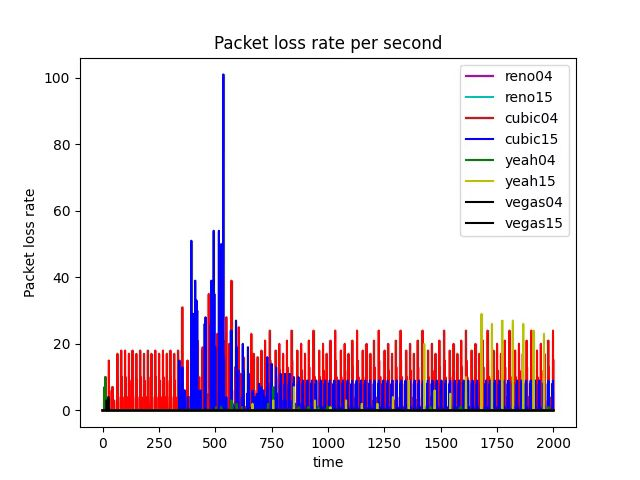
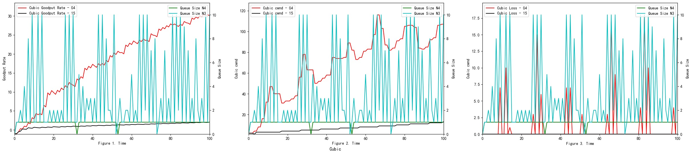

**COMP3014J Performance of Computer Systems**

------------------------------------------------------------------------

  
**Network Simulation Project Report**  

------------------------------------------------------------------------

  
**Supervisor:**  
Dr Nima Afraz  

**Group 9**  

|                                             |            |
|:--------------------------------------------|:-----------|
| Wang Yuyang: | *19206226* |
| Yang Liuxin: | *19206207* |
| Yu Jianxiang | *19206188* |

<figure>

</figure>

2

# Project Introduction

# Part A: Experimental Environment Setup

## Preparing the Ubuntu OS as a virtual machine

1.  Download and install VMWare workstation

2.  Download the Ubuntu ISO image.

3.  Create a new virtual machine in VMWare and set memory size (RAM) to
    2048 MB.

    <figure>
    <figure>
    
    <figcaption>Create a new virtual machine</figcaption>
    </figure>
    <figure>
    
    <figcaption>Memory size</figcaption>
    </figure>
    <figcaption>Analyze</figcaption>
    </figure>

4.  Create virtual hard disk and select VDI type of hard disk file and
    dynamically allocated hard disk file size.

5.  Set 20 GB of file size. When the virtual machine is ready - set 2
    CPUs, and the video memory to 128MB in the Display tab.

6.  Install Ubuntu system

## NS2 Installation

<figure>
<figure>

</figure>
<figure>

</figure>
<figcaption>Install, Clone and Test</figcaption>
</figure>

1.  Install ns2, NAM (Network Animator), and Tcl (Tool Command Language)
    and verify the installation of ns2

2.  Clone the project Git repository and Run the test file

# Part B: Network Simulator Setup

## Trace File, Trace Data Analyzer Script and Plotting

The trace file, which may contain hundreds of lines, records the
simulation’s outcome in the event’s format. Consequently, we use
scripting languages such as awk or Python to extract meaning (analyze)
from the trace file.

         cat out.tr | // Read out.tr file and pipe the output to the next command
         grep " 2 3 cbr " | // Look for 2 (from) 3 (to) cbr (type) line
         grep ^r | // Select lines start with letter 'r' (receive)
         column 1 10 | // Select column 1 - 10
         awk '{dif = $2 - old2; // check whether there is a different in time
            if(dif==0) dif = 1; 
            if(dif > 0) { // calculate jitters
                printf("%d\t%f\n", $2, ($1 - old1) / dif); old1 = $1; old2 = $2}
            }' 
         > jitter.txt // REDirect output to 'jitter.txt'

## Python library to Analyze .tr files

<figure>
<figure>

<figcaption>Python Library</figcaption>
</figure>
<figure>

<figcaption>End-to-End delay</figcaption>
</figure>
<figcaption>Analyze</figcaption>
</figure>

# TCP Congestion Control Algorithm Simulation

## Why does the plot look very unstable at the beginning of the simulation?

### End-to-End Delay

It is important to note that the End-to-End Delay measured at the N4
node changes steeply with time (see Figure
<a href="#End-to-End Delay N4" data-reference-type="ref"
data-reference="End-to-End Delay N4">1</a> and Figure
<a href="#End-to-End Delay N2" data-reference-type="ref"
data-reference="End-to-End Delay N2">2</a>). We propose two reasons for
that steep change. Firstly, there is some **time difference** between
each send due to delayed ACK response. Secondly, **two sources** may
affect the end-to-end delay. One source is packets from N1 with a delay
of $500ms + 50ms$. Another source is packets from N2 with a delay of
$800ms + 50ms$. To demonstrate our supposition’s validity, we conducted
the following comparison experiments.

<figure>
<figure id="End-to-End Delay N4">

<figcaption>End-to-End Delay at N4</figcaption>
</figure>
<figure id="End-to-End Delay N2">

<figcaption>End-to-End Delay at N4 0<em>s</em> − 15<em>s</em></figcaption>
</figure>
<figure>

<figcaption>Simulation Topology</figcaption>
</figure>
<figcaption>End-to-End delay is unstable</figcaption>
</figure>

For one thing, there is some time difference between each send. This is
because senders should wait until **ACK** is received or timeout and
then send a new packet. This includes an extra waiting time. All of
these reasons may affect the end-to-end delay.

For flow 1 (from $N_1$ to $N_5$),
$$T_{odd} =\underbrace{T(N_1 \sim N_3) + T(N_3 \sim N_4)}_{Sending}$$
$$T_{even} = \underbrace{T(N_4 \sim N_5)}_{Sending} + \underbrace{T(N_5 \sim N_4) + T(N_4 \sim N_3) + T(N_3 \sim N_1)}_{Waiting ACK \downarrow} + \underbrace{T(N_1 \sim N_3) + T(N_3 \sim N_4)}_{Next~Sending}$$

For flow 2 (from $N_2$ to $N_6$),
$$T_{odd} = \underbrace{T(N_2 \sim N_3) + T(N_3 \sim N_4)}_{Sending}$$
$$T_{even} = \underbrace{T(N_4 \sim N_6)}_{Sending} + \underbrace{T(N_6 \sim N_4) + T(N_4 \sim N_3) + T(N_3 \sim N_2)}_{Waiting ACK \downarrow} + \underbrace{T(N_2 \sim N_3) + T(N_3 \sim N_4)}_{Next~Sending}$$

Thus, the difference for these two measured time is
$T(N_4 \sim N_5) + \underbrace{T(N_5 \sim N_4) + T(N_4 \sim N_3) + T(N_3 \sim N_1)}_{Waiting ACK \downarrow}$
for flow 1 and
$T(N_4 \sim N_6) + \underbrace{T(N_6 \sim N_4) + T(N_4 \sim N_3) + T(N_3 \sim N_2)}_{Waiting ACK \downarrow}$
for flow 2.

| Time (s) |       Event       | Packet No. | E-E Delay $(\frac{cum\_interval}{samp})$ | Accumulated Interval | Sample |
|:--------:|:-----------------:|:----------:|:----------------------------------------:|:--------------------:|:------:|
|    0     |    TCP From N1    |     1      |                    0                     |          0           |   0    |
|   0.50   |   Packet 1 @ N3   |     1      |                    /                     |          0           |   0    |
| **0.55** | **Packet 1 @ N4** |   **1**    |     $\frac{0.55}{1} = 0.55 \uparrow$     |       **0.55**       | **1**  |
|   1.05   |   Packet 1 @ N5   |     1      |                    /                     |         0.55         |   1    |
|   1.55   |     ACK @ N4      |     1      |                    /                     |         0.55         |   1    |
|   1.60   |     ACK @ N3      |     1      |                    /                     |         0.55         |   1    |
|   2.10   |     ACK @ N1      |     1      |                    /                     |         0.55         |   1    |
|   2.10   |    TCP From N1    |     2      |                    /                     |         0.55         |   1    |
|   2.60   |   Packet 2 @ N3   |     2      |                    /                     |         0.55         |   1    |
| **2.65** | **Packet 2 @ N4** |   **2**    |    $\frac{2.65}{2} = 1.325 \uparrow$     |       **2.65**       | **2**  |

Waiting Time (Waiting for ACK)

For another, we use the following codes to show how the E-E delay
changes with time if we include only one source. The first below block
closes the N2 source, and the second below block closes the N1 source.

    //$ns at 0.0 "$myftp2 start"
    $ns at 0.0 "$myftp1 start

    $ns at 0.0 "$myftp2 start"
    //$ns at 0.0 "$myftp1 start

When we only include a single source, the trends change regularly, which
is different to our previous random and steep changes (see Figure
<a href="#Only" data-reference-type="ref" data-reference="Only">4</a>).

<figure id="Only">
<figure id="Only">

<figcaption>Include source 1 (N1 node)</figcaption>
</figure>
<figure>

<figcaption>Include source 2 (N2 node)</figcaption>
</figure>
<figcaption>Only include one source</figcaption>
</figure>

Now we take the Reon TCP congestion control algorithms as an example,
which also applies to other congestion control algorithms.

| Time (s) |       Event       |  Packet No.  | E-E Delay $(\frac{cum\_interval}{samp})$ | Accumulated Interval |  Sample  |
|:--------:|:-----------------:|:------------:|:----------------------------------------:|:--------------------:|:--------:|
|    0     |    TCP from N1    |   Packet 1   |                    /                     |          0           |    0     |
|    0     |    TCP from N2    |   Packet 2   |                    /                     |          0           |    0     |
|   0.5    |   Packet 1 @ N3   |   Packet 1   |                    /                     |          0           |    0     |
| **0.55** | **Packet 1 @ N4** | **Packet 1** |     $\frac{0.55}{1} = 0.55 \uparrow$     |       **0.55**       |  **1**   |
|   0.8    |   Packet 2 @ N3   |   Packet 2   |                    /                     |         0.55         |    1     |
| **0.85** | **Packet 2 @ N4** | **Packet 2** |   $\frac{0.85}{2} = 0.425 \downarrow$    |       **0.85**       |  **2**   |
| $\vdots$ |     $\vdots$      |   $\vdots$   |                 $\vdots$                 |       $\vdots$       | $\vdots$ |

E-E Delay when two sources present in the network

Overall, the above experiments demonstrate our assumption that both
**two sources** and **waiting time** leads to the steep trends of Figure
<a href="#End-to-End Delay N4" data-reference-type="ref"
data-reference="End-to-End Delay N4">1</a> and Figure
<a href="#End-to-End Delay N2" data-reference-type="ref"
data-reference="End-to-End Delay N2">2</a>.

### GoodPut Rate and Packet Loss Rate

**Take TCP Reno Congestion Control Algorithm as an Example**

<figure id="Only12">
<figure id="Only11">

<figcaption>Goodput rate</figcaption>
</figure>
<figure>

<figcaption>Packet loss</figcaption>
</figure>
<figcaption>GoodPut Rate and Packet Loss Rate are Unstable</figcaption>
</figure>

TCP Reno is an extension of TCP Tahoe, and their slow start and AIMD
phase are the same. In TCP Reno, the cwnd is cyclically changed in a
typical situation. The cwnd continues to increase until packet loss
occurs. TCP Reno has two phases in increasing its cwnd: slow start phase
and congestion avoidance phase . In othrt words, TCP Reno is composed of
TCP Tahoe and fast recovery (see Figure
<a href="#aaaaaaaaaaaaaaaaaaa" data-reference-type="ref"
data-reference="aaaaaaaaaaaaaaaaaaa">9</a>).

<figure id="aaaaaaaaaaaaaaaaaaa">
<figure id="fig:my_label">

<figcaption>Reno Algorithm</figcaption>
</figure>
<figure id="Relationship">

<figcaption>Reno Simulation Result</figcaption>
</figure>
<figcaption>GoodPut Rate and Packet Loss Rate are Unstable</figcaption>
</figure>

The GoodPut rate was **unstable** at the beginning due to the following
reasons. Firstly, the beginning of the Reno algorithm is a **slow
start** process, in which the cwnd increases exponentially, so the
GoodPut rate also increases rapidly. Secondly, at around 15 seconds, the
**GoodPut** is **not stable** enough because the cwnd increases too
fast, and there is packet loss.

Moreover, the **loss** is **not stable** enough because, initially, the
Reno algorithm needs to **determine the value of cwnd based on the
network conditions**. Therefore, at 15 seconds, there is an excessive
cwnd, which leads to packet loss.

**The explanation also applies to other congestion control algorithms
(Vegas, Cubic, Yeah).**

### TCP Vegas

TCP Reno models can determine the network’s congestion only when packet
loss occurs in the system. In TCP Reno model, when packet loss occurs,
the window size is decreased, and the system enters the congestion
avoidance phase. While TCP Vegas senses the congestion in the network
before any packet loss occurs, it instantly decreases the cwnd.
Therefore, TCP Vegas handles the congestion without any packet loss
occurring. $$Extra~Data = (expectedOutput-actualOutput)*baseRTT$$
$$\alpha \leq (expectedOutput-actualOutput)*baseRTT \leq \beta$$

- If $Extra~Data > \beta$, Decrease Window Size, $cwnd=cwnd-1$

- If $Extra~Data < \alpha$, Increase Window Size, $cwnd=cwnd+1$

- If $\alpha \leq Extra~Data \leq \beta$, Maintaine Window Size,
  $cwnd=cwnd$

TCP Vegas attempts to utilize the network’s bandwidth without congestion
in the network. The window size of TCP Vegas converges to the point that
lies between $w + \alpha$ and $w + \beta$. TCP Vegas has congestion
control ability and also gives stability to the network, but it can not
fully use the bandwidth.

<figure id="Vegas Simulation Result">

<figcaption>Vegas Simulation Result</figcaption>
</figure>

### TCP YeAH

YeAH-TCP envisages two different operations: “Fast” and “Slow” modes,
like Africa TCP. During the “Fast” mode, YeAH-TCP increments the cwnd
according to an aggressive rule (STCP rule). In the “Slow” mode, it acts
as Reno TCP.

<figure id="YeAH Simulation Result">

<figcaption>YeAH Simulation Result</figcaption>
</figure>

### TCP Cubic

<figure id="Cubic Simulation Result">

<figcaption>Cubic Simulation Result</figcaption>
</figure>

The window size in CUBIC is a cubic function of time since the most
recent congestion event, with the inflection point set to the window
size before the incident. The window growth function has two components
because it is a cubic function. The window size quickly rises to the
size prior to the most recent congestion incident in the first concave
region. The convex expansion follows, where CUBIC initially searches for
more bandwidth slowly and quickly. The network can stabilize because
CUBIC spends a lot of time at a plateau between the concave and convex
growth regions before it asks for more bandwidth.

## What do you conclude after seeing these results? Which algorithm is better?

To decide which algorithm performs best, we analyze the trade-off of
each algorithm at first.

**Reno** algorithm is a conservative algorithm, which includes slow
start, congestion avoidance, fast re-transmission, and fast recovery
mechanisms. The cwnd of Reno algorithm decreases quickly and grows
slowly, especially in the large-window environment. It takes a long time
to recover the reduced cwnd caused by the loss of a datagram. In this
way, the bandwidth utilization cannot be very high, and this
disadvantage will become more and more obvious with the continuous
improvement of the network link bandwidth. In terms of fairness, the
Reno algorithm can fairly allocate resources so that one party does not
occupy a large number of resources, resulting in insufficient resources
for other nodes (see Figure
<a href="#Relationship" data-reference-type="ref"
data-reference="Relationship">8</a>).

The **Vegas** algorithm takes the increase of delay RTT as the signal of
network congestion. The increase of RTT leads to decreased cwnd, and the
decrease of RTT leads to an increased congestion window. Specifically,
Vegas adjusts the size of the congestion window by comparing the actual
throughput with the expected throughput. However, Vegas algorithm is
inferior to Reno in fairness. For example, it can be seen in the Figure
<a href="#Vegas Simulation Result" data-reference-type="ref"
data-reference="Vegas Simulation Result">10</a> that Vegas occupies much
more bandwidth on link 04 than link 15. At the same time, the overall
resource utilization of the algorithm is also relatively low.

The **Yeah** algorithm defines two patterns. Fast mode and Slow mode,
which are more aggressive in Fast mode, behave the same way as Reno in
Slow mode. It solves the problem that Reno algorithm can not use all the
bandwidth and ensures fair and reasonable allocation of resources. At
the same time, it also has a low packet loss rate (see Figure
<a href="#YeAH Simulation Result" data-reference-type="ref"
data-reference="YeAH Simulation Result">11</a>).

The advantage of the **Cubic** algorithm is that as long as there is no
packet loss, it will not actively reduce its sending speed. It can
maximize the remaining bandwidth of the network, improve the throughput,
and play a better performance in the network with high bandwidth and low
packet loss rate. However, while the Cubic algorithm has high bandwidth
utilization, it still increases the cwnd, which indirectly increases the
packet loss rate (see Figure
<a href="#Cubic Simulation Result" data-reference-type="ref"
data-reference="Cubic Simulation Result">12</a>), resulting in the
aggravation of the network jitter.

Having discussed each algorithm’s features, we now analyze **which one
is better**.

Each algorithm has its own advantages and disadvantages and applicable
scenarios. In general, the Reno algorithm and Vegas are more
conservative, which is also in line with its appearance in the early
days of the Internet. Yeah algorithm solves part of the problems of the
Reno algorithm, but in the case of high latency and high packet loss
rate for a long time into Slow mode, and Reno algorithm is consistent.
The cubic algorithm is more aggressive. The Cubic algorithm is more
aggressive and has a higher packet loss rate, but it can guarantee high
transmission speed in a poor network environment.

## How reliable are these results, and how confident are you about the conclusion you have made based on these results?

To determine to which extent these results are reliable, we need to
analyze the following aspects.

- Reliable

  - The simulation is performed in a real situation setting and
    therefore reflects the performance of the real situation under this
    specific condition.

- Unreliable

  - The given simulation only lasts 100 seconds, which means the
    *GoodPut rate* may have **not converged** yet. Possible convergence
    will occur if time extends.

  - The parameters, such as bandwidth and latency, are **not random**
    enough to demonstrate the practical situation.

  - Since the simulation adapt TCP as the only protocol, the output may
    have a different result when utilizing HTTP, UDP or Telnet.
    Therefore, further experiments are required to verify the
    correctness.

  - The conditions for **practical situations** are more **complex** to
    set than in the simulation, so the results may not be reliable or
    indicative.

  - The **setting** of **practical situations** may change
    **dynamically**, so the results may not be reliable or indicative.

  - The parameters of current files only include Goodput rate and loss,
    which are **insufficient**.

## How could you improve the confidence in your results?

To find an efficient way to improve the results based on the unreliable
aspects written in Section 4.2, we conducted some experiments, including
randomly established parameters and extending the testing duration.

- To alleviate the random parameters or settings, we replace the Telnet
  protocol with the FTP protocol by changing the following code.

      set mytelnet [new Application/Telnet]
      $mytelnet attach-agent $source1

  Then we compare the effectiveness of each algorithm (see Figure
  <a href="#Robustness Analyze - Telnet" data-reference-type="ref"
  data-reference="Robustness Analyze - Telnet">23</a>).

- We avoid the problem that the experiment may not achieve the Extending
  the testing duration:

  <figure id="bottleneck">
  <figure id="Robustness Analyze - Telnet">
  
  <figcaption>Goodput of Telnet</figcaption>
  </figure>
  <figure>
  
  <figcaption>1000s - Goodput</figcaption>
  </figure>
  <figure>
  
  <figcaption>1000s - Loss</figcaption>
  </figure>
  <figure>
  
  <figcaption>Extend to 2000s</figcaption>
  </figure>
  <figcaption>Impact of the bottleneck</figcaption>
  </figure>

- We solve the disadvantage of insufficient parameters by adding more
  parameters (see Figure
  <a href="#Relationship" data-reference-type="ref"
  data-reference="Relationship">8</a>,
  <a href="#Vegas Simulation Result" data-reference-type="ref"
  data-reference="Vegas Simulation Result">10</a>,
  <a href="#YeAH Simulation Result" data-reference-type="ref"
  data-reference="YeAH Simulation Result">11</a>,
  <a href="#Cubic Simulation Result" data-reference-type="ref"
  data-reference="Cubic Simulation Result">12</a>)

## What is the equation used in “analyser.py” to calculate the GoodPut?

We calculate the number of ACK, which can be seen as the Goodput rate
using Equation
<a href="#goo" data-reference-type="ref" data-reference="goo">[goo]</a>,
where $N$ represents the Number of ACK packets, $C$ represents Packet
size, and $T$ represents the Measurement interval.
$$GoodPutRate = \frac{N \times C}{T} = \frac{d(N) \times C}{d(T)} = C \times \left(\frac{N}{T}\right)^{'} 
    \label{goo}$$

# Queuing Algorithms

## Impact of the bottleneck link’s queuing algorithm - DropTail and RED

<figure id="Only12">
<figure id="Only11">

 

</figure>
<figure>

</figure>
<figcaption>RED</figcaption>
</figure>

Random Early Detection (RED) loses packets in advance, while DropTail
only loses packets when it reaches the maximum queue limit . Here are
examples of how Cubic performs using different bottleneck link’s queuing
algorithms (see Figure
<a href="#Cubic QueueSize - DropTail" data-reference-type="ref"
data-reference="Cubic QueueSize - DropTail">21</a> and
<a href="#Cubic QueueSize - RED" data-reference-type="ref"
data-reference="Cubic QueueSize - RED">22</a>).

<figure id="Robustne1ss Analyze">
<figure id="1111">

<figcaption>End-to-end delay</figcaption>
</figure>
<figure id="Robustness Analyze - Telnet1">

<figcaption>Goodput rate</figcaption>
</figure>
<figure id="222">

<figcaption>Packet loss</figcaption>
</figure>
<figcaption>Impact of the bottleneck - RED</figcaption>
</figure>

In the given experiments setting, when we compare Figure
<a href="#1111" data-reference-type="ref" data-reference="1111">17</a>
(RED), Figure <a href="#End-to-End Delay N4" data-reference-type="ref"
data-reference="End-to-End Delay N4">1</a> (DropTail) and Figure
<a href="#End-to-End Delay N2" data-reference-type="ref"
data-reference="End-to-End Delay N2">2</a> (DropTail), we can see that
RED performs better than DropTail. This is because four different
congestion control algorithms generally have lower end-to-end delays
when using the RED bottleneck link’s queuing algorithm. Moreover, if we
compare Figure
<a href="#Cubic QueueSize - RED" data-reference-type="ref"
data-reference="Cubic QueueSize - RED">22</a> 1 (RED) and Figure
<a href="#Cubic QueueSize - DropTail" data-reference-type="ref"
data-reference="Cubic QueueSize - DropTail">21</a> 1 (DropTail), we can
see that DropTail performs better than RED in terms of Goodput rate.

<figure id="Cubic QueueSize - DropTail">

<figcaption>Cubic QueueSize - DropTail</figcaption>
</figure>

<figure id="Cubic QueueSize - RED">

<figcaption>Cubic QueueSize - RED</figcaption>
</figure>

RED adds two new mechanisms to queue management. Firstly, instead of
waiting for the queue to be full without dropping incoming packets, it
uses a probabilistic determination mechanism to drop some packets in
advance to prevent possible congestion. Secondly, it adjusts the packet
drop probability by averaging the queues instead of instant queues.
Therefore, it can absorb some transient bursts of traffic as much as
possible. Moreover, the performance of the RED algorithm is sensitive to
the design parameters and network conditions. These conditions can still
lead to multiple TCP synchronization under specific network load
conditions, resulting in throughput oscillations and increased delay
jitter.

## Repeat experiments with smaller and larger link capacity for the bottleneck link and discuss which algorithm worked better when congestion was worse

We noticed that in the given simulation scenario, the bandwidth as
1000Mb is not the bottleneck of this network (as shown in Figure
<a href="#linkspeed-test" data-reference-type="ref"
data-reference="linkspeed-test">24</a>), but the latency and queue size
significantly affect the performance of the network.

<figure id="linkspeed-test">
<figure id="Robustness Analyze - Telnet">

<figcaption>Reno</figcaption>
</figure>
<figure>

<figcaption>Cubic</figcaption>
</figure>
<figure>

<figcaption>Yeah</figcaption>
</figure>
<figure>

<figcaption>Cubic</figcaption>
</figure>
<figcaption>Throughput of 4 Algorithms</figcaption>
</figure>

In this section, we change three different simulation scenarios and show
that RED can perform much better in certain conditions.

**Setting @** is shown in the following code block. As is shown in
Figure <a href="#1mb-lower-bandwidth-RED-loss" data-reference-type="ref"
data-reference="1mb-lower-bandwidth-RED-loss">25</a> and Figure
<a href="#1mb-lower-bandwidth-DropTail-loss" data-reference-type="ref"
data-reference="1mb-lower-bandwidth-DropTail-loss">27</a>, RED performs
better than DropTail because it has a lower average loss. Moreover,
during the time interval 0-4s, all algorithms reach the highest packet
loss. Similarly, RED also performs better than DropTail because it has a
high average Goodput rate (see Figure
<a href="#1mb-lower-bandwidth-RED-goodput" data-reference-type="ref"
data-reference="1mb-lower-bandwidth-RED-goodput">26</a> and
<a href="#1mb-lower-bandwidth-DropTail-goodput"
data-reference-type="ref"
data-reference="1mb-lower-bandwidth-DropTail-goodput">28</a>).
Specifically, RED is more **stable** than DropTail, as is illustrated in
terms of both packet loss and Goodput rate (see Figure
<a href="#Simulation Scenario Setting \@slowromancap\romannumeral 1@"
data-reference-type="ref"
data-reference="Simulation Scenario Setting \@slowromancap\romannumeral 1@">29</a>).
For example, in Figure <a href="#1mb-lower-bandwidth-DropTail-goodput"
data-reference-type="ref"
data-reference="1mb-lower-bandwidth-DropTail-goodput">28</a>, Goodput
rate, when applied to the DropTail algorithm, firstly increases and
decreases when it reaches the peak at time 10s. In comparison, Goodput
rate, when applied to the RED algorithm, remains a relatively stable
high value. Therefore, in setting @, RED performs generally better than
DropTail, which can be reflected by the less packet loss and higher
Goodput rate of RED.

    // It is not necessary to have a fast connection, but latency may significantly affect the network's performance.
    // So we reduced the value of latency and speed; by doing this the transmission can reach the highest capacity of the bottleneck link. 
    $ns duplex-link $n1 $n3 4Mb 50ms DropTail
    $ns duplex-link $n2 $n3 4Mb 80ms DropTail 
    $ns duplex-link $n3 $n4 1Mb 5ms  DropTail // and RED
    $ns duplex-link $n4 $n5 4Mb 50ms DropTail
    $ns duplex-link $n4 $n6 4Mb 80ms DropTail

<figure id="Simulation Scenario Setting \@slowromancap\romannumeral 1@">
<figure id="1mb-lower-bandwidth-RED-loss">

<figcaption>Loss - RED</figcaption>
</figure>
<figure id="1mb-lower-bandwidth-RED-goodput">

<figcaption>Goodput - RED</figcaption>
</figure>
<figure id="1mb-lower-bandwidth-DropTail-loss">

<figcaption>Loss - DropTail</figcaption>
</figure>
<figure id="1mb-lower-bandwidth-DropTail-goodput">

<figcaption>Goodput - DropTail</figcaption>
</figure>
<figcaption>Simulation Scenario @</figcaption>
</figure>

**Setting @** is shown in the following code block. We also tried
another setting and saw the result. As is shown in Figure
<a href="#100queue-0.5mb-lower-bandwidth-RED-loss"
data-reference-type="ref"
data-reference="100queue-0.5mb-lower-bandwidth-RED-loss">30</a> and
<a href="#100queue-0.5mb-lower-bandwidth-DropTail-loss"
data-reference-type="ref"
data-reference="100queue-0.5mb-lower-bandwidth-DropTail-loss">32</a>,
RED performs better than DropTail since it has a relatively lower
average loss. Moreover, during the time interval 0-4s, all algorithms
reach the highest packet loss. Similarly, RED also performs better than
DropTail because it has a high average Goodput rate (see Figure
<a href="#100queue-0.5mb-lower-bandwidth-RED-goodput"
data-reference-type="ref"
data-reference="100queue-0.5mb-lower-bandwidth-RED-goodput">31</a> and
<a href="#100queue-0.5mb-lower-bandwidth-DropTail-goodput"
data-reference-type="ref"
data-reference="100queue-0.5mb-lower-bandwidth-DropTail-goodput">33</a>).
Specifically, RED is more **stable** than DropTail, as is illustrated in
terms of both packet loss and Goodput rate (see Figure
<a href="#Simulation Scenario Setting \@slowromancap\romannumeral 2@"
data-reference-type="ref"
data-reference="Simulation Scenario Setting \@slowromancap\romannumeral 2@">34</a>).
For example, in Figure
<a href="#100queue-0.5mb-lower-bandwidth-DropTail-goodput"
data-reference-type="ref"
data-reference="100queue-0.5mb-lower-bandwidth-DropTail-goodput">33</a>,
Goodput rate, when applied to the DropTail algorithm, firstly increases
and decreases when it reaches the peak at time 10s. In comparison,
Goodput rate, when applied to the RED algorithm, remains a relatively
stable high value. Therefore, in setting @, RED performs generally
better than DropTail, which can be reflected by the less packet loss and
higher Goodput rate of RED.

    // RED algorithm considers the queue size. Thus, we set Queue limit to 100 and further reduced the speed of the bottleneck link.
    $ns duplex-link $n1 $n3 4Mb   50ms DropTail
    $ns duplex-link $n2 $n3 4Mb   80ms DropTail 
    $ns duplex-link $n3 $n4 0.5Mb 5ms  DropTail // and RED
    $ns duplex-link $n4 $n5 4Mb   50ms DropTail
    $ns duplex-link $n4 $n6 4Mb   80ms DropTail

    // Increase Queue Limit to 100
    $ns queue-limit $n3 $n4 100
    $ns queue-limit $n4 $n3 100

<figure id="Simulation Scenario Setting \@slowromancap\romannumeral 2@">
<figure id="100queue-0.5mb-lower-bandwidth-RED-loss">

<figcaption>Loss - RED</figcaption>
</figure>
<figure id="100queue-0.5mb-lower-bandwidth-RED-goodput">

<figcaption>Goodput - RED</figcaption>
</figure>
<figure id="100queue-0.5mb-lower-bandwidth-DropTail-loss">

<figcaption>Loss - DropTail</figcaption>
</figure>
<figure id="100queue-0.5mb-lower-bandwidth-DropTail-goodput">

<figcaption>Goodput - DropTail</figcaption>
</figure>
<figcaption>Simulation Scenario @</figcaption>
</figure>

**Setting @** is shown in the following code block. We also try another
setting and see the result. As is shown in Figure
<a href="#largedelay500-200queue-0.5mb-lower-bandwidth-RED-loss"
data-reference-type="ref"
data-reference="largedelay500-200queue-0.5mb-lower-bandwidth-RED-loss">35</a>
and
<a href="#largedelay500-200queue-0.5mb-lower-bandwidth-DropTail-loss"
data-reference-type="ref"
data-reference="largedelay500-200queue-0.5mb-lower-bandwidth-DropTail-loss">37</a>,
RED performs better than DropTail since it has a remarkably lower loss.
Similarly, RED also performs better than DropTail because it has a high
Goodput rate (see Figure
<a href="#largedelay500-200queue-0.5mb-lower-bandwidth-RED-goodput"
data-reference-type="ref"
data-reference="largedelay500-200queue-0.5mb-lower-bandwidth-RED-goodput">36</a>
and
<a href="#largedelay500-200queue-0.5mb-lower-bandwidth-DropTail-goodput"
data-reference-type="ref"
data-reference="largedelay500-200queue-0.5mb-lower-bandwidth-DropTail-goodput">38</a>).
Specifically, RED is more **stable** than DropTail, as is illustrated in
terms of both packet loss and Goodput rate (see Figure
<a href="#Simulation Scenario Setting \@slowromancap\romannumeral 3@"
data-reference-type="ref"
data-reference="Simulation Scenario Setting \@slowromancap\romannumeral 3@">39</a>).
For example, in Figure
<a href="#largedelay500-200queue-0.5mb-lower-bandwidth-DropTail-goodput"
data-reference-type="ref"
data-reference="largedelay500-200queue-0.5mb-lower-bandwidth-DropTail-goodput">38</a>,
Goodput rate, when applied to the DropTail algorithm, firstly increases
and decreases and then shows an increasing trend again. In comparison,
Goodput rate, when applied to the RED algorithm, remains a relatively
stable ascending trend. Therefore, in setting @, RED performs generally
better than DropTail, which can be reflected by the less packet loss and
higher Goodput rate of RED.

    // Here, we simulated a really poor network connection where the latency and connection speed were high. 
    $ns duplex-link $n1 $n3 4Mb   500ms DropTail
    $ns duplex-link $n2 $n3 4Mb   800ms DropTail 
    $ns duplex-link $n3 $n4 0.5Mb 50ms  DropTail // and RED
    $ns duplex-link $n4 $n5 4Mb   500ms DropTail
    $ns duplex-link $n4 $n6 4Mb   800ms DropTail

    // Increase Queue Limit to 200
    $ns queue-limit $n3 $n4 200
    $ns queue-limit $n4 $n3 200

<figure id="Simulation Scenario Setting \@slowromancap\romannumeral 3@">
<figure id="largedelay500-200queue-0.5mb-lower-bandwidth-RED-loss">

<figcaption>Loss - RED</figcaption>
</figure>
<figure id="largedelay500-200queue-0.5mb-lower-bandwidth-RED-goodput">

<figcaption>Goodput - RED</figcaption>
</figure>
<figure id="largedelay500-200queue-0.5mb-lower-bandwidth-DropTail-loss">

<figcaption>Loss - DropTail</figcaption>
</figure>
<figure
id="largedelay500-200queue-0.5mb-lower-bandwidth-DropTail-goodput">

<figcaption>Goodput - DropTail</figcaption>
</figure>
<figcaption>Simulation Scenario Setting @</figcaption>
</figure>

# Conclusion

Although RED is effective in avoiding congestion, the algorithm still
suffers from the following major shortcomings. The first problem is
fairness. The RED algorithm cannot effectively handle connections that
do not respond to congestion notifications, so such connections often
crowd a large amount of network bandwidth, resulting in various
connections sharing bandwidth unfairly. Another problem is parameter
setting. The RED algorithm is sensitive to parameter settings, and small
changes in the two threshold values and the maximum packet loss
probability are often a significant impact on network performance, if
the most appropriate parameters are selected according to the specific
business environment is an important issue for RED. In addition, a set
of parameters may result in higher throughput, but may also result in
higher packet loss and longer time delays. How to configure the
parameters so that the algorithm achieves better performance in terms of
throughput, time delay, and packet loss rate also needs to be addressed.
Finally, RED also has network performance issues. The average queue
length controlled by the RED algorithm often increases as the number of
connections increases, causing transmission delay jitter and causing
unstable network performance.

\|l\|l\|l\|l\|l\| & & & &  
& & & &  
& & & &  
& & & &  
& & & &  
& & & &  
& & & &  
& & & &  
& & & &  
& & & &  
& & & &  
& & & &  
& & & &  
& & & &  
& & & &  
& & & &  
& & & &  
& & & &  
& & & &  
& & & &  
& & & &  
& & & &  
& & & &  
& & & &  
& & & &  
& & & &  
& & & &  
& & & &  
& & & &  
& & & &  
& & & &  
& & & &  

| Name         | Total Student Score | Total Student Score / Total Tasks Score |
|:-------------|:--------------------|:---------------------------------------:|
| Yuyang Wang  | 45                  |                $45/120$                 |
| Liuxin Yang  | 42                  |                $42/120$                 |
| Jianxiang Yu | 33                  |                $33/120$                 |
| Total        | 120                 |                                         |
| 1-2          |                     |                                         |

Project’s Student Score Breakdown Table

| Signature: |  |     |       |            |
|:-----------|:-------------------------------------------------------------------|:----|:------|:-----------|
| 2-5        | Student 1 Name: Yuyang Wang                                        |     | Date: | 2022/11/04 |
| Signature: |                                                       |     |       |            |
|            | Student 2 Name: Liuxin Yang                                        |     | Date: | 2022/11/04 |
| Signature: |           |     |       |            |
|            | Student 3 Name: Jianxiang Yu                                       |     | Date: | 2022/11/04 |

Group Member Signature

The reason for the difference between the group contract and final
report is that our contribution may differ in practice. Many thanks for
your understanding.
